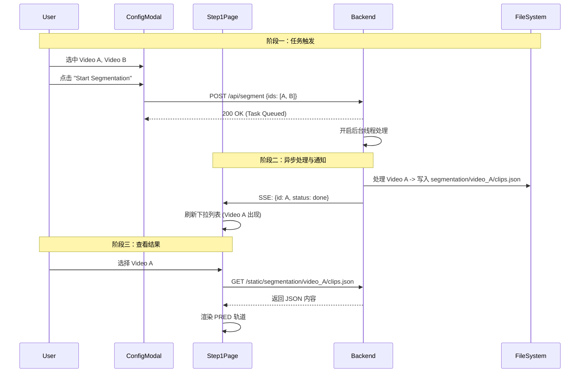

# Stage 1: 片段切分 (Segmentation) 前后端对齐方案

本阶段目标是实现从**资源管理**到**视觉切分**的完整闭环。
本阶段目标是将后端的切分工作流与前端 `Step1Segmentation` 组件及 `ProjectConfigModal` 界面打通，实现“前端多选触发 -> 后端异步处理 -> 实时状态反馈 -> 结果可视化”的闭环。
核心变更点在于将原本的前端模拟执行改为**后端异步任务驱动**，并在文件系统层面确立了切分结果 (`clips.json`) 的存储标准。

#### 0. 文件系统与数据流扩展

*   **输出目录**: 使用 `workspace/segmentation/{video_id}/` 目录结构。
    *   `workspace/segmentation/{video_id}/clips.json`: 存放切分结果。
    *   此结构便于多项目隔离和重跑产物管理。
*   **数据流向**: 
    1.  用户在 ProjectConfigModal 选择视频 -> 触发切分。
    2.  后端生成 `workspace/segmentation/{video_id}/clips.json`。
    3.  前端通过 `/static/segmentation/{video_id}/clips.json` 读取结果并在 Step 1 渲染。
---

## 1. 后端架构与逻辑扩展 (FastAPI)

后端不仅要提供 API，还要作为任务调度器 (Task Scheduler) 管理耗时的切分任务。

### A. 文件系统扩展
在 `workspace/` 下新增用于存储切分结果的目录：
```text
workspace/
├── videos/
├── gt/
├── thumbnails/
└── segmentation/           # [新增] 存放切分结果
    ├── video_A/
    │   └── clips.json       # 对应 video_A.mp4 的切分数据
    └── video_B/
        └── clips.json
```

### B. API 接口扩展

#### 1. 资源查询增强 (`GET /api/assets`)
在原有基础上增加切分状态字段。
    *   **逻辑变更**: 扫描时检查 `workspace/segmentation/{video_id}/clips.json` 是否存在。
*   **新增响应字段**:
    ```json
    {
      "id": "video_A",
      // ... 原有字段
      "segmented": true,                               // [新增] bool, 标记是否已存在 clips.json
      "clips_url": "/static/segmentation/video_A/clips.json",       // [新增] 结果文件的静态访问路径
      "duration": 124.5                                // [关键] 若未缓存，需用 ffmpeg probe 获取准确时长
    }
    ```

#### 2. 触发切分任务 (`POST /api/segment`)
*   **输入**: `{ "video_ids": ["video_A", "video_B"], "force": false }`
    *   `video_ids`: 待处理视频 ID 列表。
    *   `force`: 若为 true，覆盖已存在的 `workspace/segmentation/{video_id}/clips.json`。
*   **逻辑 (Background Task)**:
    1.  **状态标记**: 立即将任务状态标记为 `queued` -> `running`。
    2.  **异步执行**: 启动后台线程/进程。
    3.  **串行处理**: 遍历列表，明确采用串行处理策略，逐个处理视频以避免资源过载。对每个视频调用 `vidsynth.segment.segment_video`。
    4.  **结果持久化**: 将生成的片段列表保存为 `workspace/segmentation/{video_id}/clips.json`。
    5.  **状态广播**: 每个视频处理完，通过 SSE 推送 `done` 事件（携带 `result_path`）。
    
#### 3. 实时状态流 (`GET /api/events`)
*   **协议**: Server-Sent Events (SSE).
*   **职责**: 解决 HTTP 请求无法实时获取后台任务进度的问题。
*   **事件结构**（与 `UNIFIED_SYSTEM_DESIGN.md` 一致）:
    ```json
    {
      "stage": "segment",
      "video_id": "video_A",
      "status": "queued|running|cached|done|error",
      "progress": 0.0,
      "message": "human readable",
      "result_path": "segmentation/video_A/clips.json"
    }
    ```

---

## 2. 前端功能与交互逻辑 (React)

前端主要涉及两个组件的深度改造：`ProjectConfigModal` (作为任务控制台) 和 `Step1Segmentation` (作为结果查看器)。

### A. `components/ProjectConfigModal.tsx` (任务管理)

**目标**: 让用户在这里发起切分任务，而不是在 Step 1 页面。

1.  **UI 改造**:
    *   **Grid Item**: 每个视频卡片增加一个状态角标 (Badge)。
        *   🟢 `Done/Cached` (已切分/已缓存)
        *   🟡 `Running` (进行中)
        *   ⚪ `Queued` (待切分)
    *   **多选支持**: 点击卡片不再只是单选高亮，而是支持 `toggle` 多选（或增加 Checkbox）。
    *   **底部操作栏**: 当有视频被选中时，底部显示操作按钮。
        *   **"Start Segmentation"**: 仅对选中的 `Queued` 视频有效。
        *   **"Re-segment"**: 对选中的 `Done/Cached` 视频有效（覆盖）。

2.  **交互逻辑**:
    *   **点击 "Start"**: 调用 `POST /api/segment`，传入选中 ID。
    *   **状态反馈**: 按钮变 loading 态。即使关闭 Modal，后台任务仍在继续，通过全局 Context 或 SSE 监听保持状态同步。

### B. `components/Step1Segmentation.tsx` (结果可视化)

**目标**: 纯粹的数据展示组件，不再负责“执行”。

1.  **数据源逻辑**:
    *   **下拉选择框**:
        *   **过滤**: 仅列出 `segmented === true` 的视频。如果列表为空，显示空态提示“请先在配置面板进行切分”。
        *   **自动选择**: 组件加载时，自动选中第一个已切分的视频。
    *   **进度条逻辑**:
        *   **移除**: 删除旧的 `executionState` 模拟逻辑。
        *   **新增**: 顶部增加一个全局 SSE 监听器。如果当前选中的视频正在被“重切分”，显示真实的后端进度百分比。

2.  **Timeline 绘制逻辑**:
    *   **GT 轨道**:
        *   检查 `video.hasGT`。
        *   `true`: `fetch(video.gt_url)` 获取数据 -> 渲染绿色滑块。
        *   `false`: 渲染红色斜线背景区域，并覆盖文字 "Missing Ground Truth Data"。
    *   **PRED 轨道 (System Prediction)**:
        *   `fetch(video.clips_url)` 获取后端生成的真实 JSON。
        *   **数据映射**: 后端 JSON 字段 (`t_start`, `t_end`) -> 前端 `Segment` 对象 (`start`, `end`)。
        *   **渲染**: 遍历片段数组，按比例 `(end - start) / duration` 计算 `width` 和 `left`，绘制蓝色滑块。
    *   **悬浮弹窗 (Tooltip)**:
        *   `onMouseEnter`: 显示当前片段的精确时间 `00:12.500 - 00:15.200`。
        *   **交互增强**: 点击片段，控制播放器跳转到该片段的 `start` 时间。

3.  **播放器联动**:
    *   `src` 属性绑定 `video.video_url` (即 `/static/videos/...`)。
    *   **大视频问题**: 若后端返回的 `duration` 字段为空，前端需在 `onLoadedMetadata` 事件中更新 timeline 的总时长，防止比例尺错误。

### 总结：交互流程图


