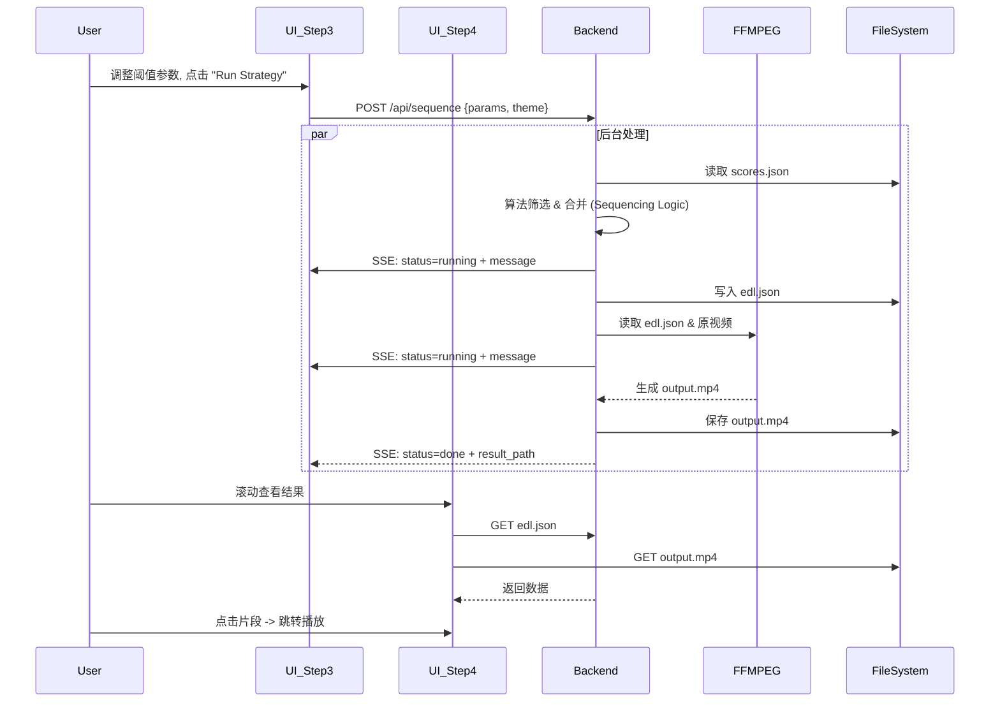

# Stage 3 & 4: 编排与生成 (Sequencing & Generation) 前后端对齐方案

这两步是将零散的“切片”组装成“成片”的关键环节。
*   **Stage 3 (Sequencer)**: 负责逻辑。根据用户设定的阈值和策略，从打分结果中筛选片段，并决定它们的顺序和拼接方式（生成 EDL）。
*   **Stage 4 (Exporter)**: 负责物理生成。根据 EDL 调用 FFmpeg 将视频片段实际拼接成最终的 MP4 文件。

---

## 0. 文件系统与数据流扩展

使用统一的 `workspace/edl/` 与 `workspace/exports/` 目录管理产物：

```text
workspace/
└── edl/
    └── skiing/
        └── video_A/
            └── edl.json    # [Stage 3 Output] 剪辑决定列表 (Edit Decision List)
└── exports/
    └── skiing/
        └── video_A/
            └── output.mp4  # [Stage 4 Output] 最终合成视频
```

---

## 1. 后端架构与逻辑扩展 (FastAPI)

### A. API 接口设计

我们将其合并为一个连贯的工作流接口，但在逻辑上保持模块化。

#### 1. 执行编排策略 (`POST /api/sequence`)
*   **职责**: 接收策略参数，生成 EDL，并(可选)立即触发渲染。
*   **输入**:
    ```json
    {
      "theme": "skiing",
      "params": {
        "upper_threshold": 0.20,
        "lower_threshold": 0.21,  // 迟滞比较器参数
        "min_duration": 2.0,
        "max_duration": 6.0,
        "merge_gap": 1.0
      },
      "force": false,             // 是否覆盖已有 EDL
      "video_ids": ["video_A"]    // 可选：限定视频
    }
    ```
*   **逻辑 (Background Task)**:
    1.  **Load**: 读取 `workspace/themes/{theme_slug}/scores.json`。
    2.  **Filter & Merge (Stage 3)**:
        *   **Filtering**: 应用双阈值算法 (Hysteresis Thresholding) 筛选高分片段。
        *   **Duration Check**: 应用 `min/max duration` 过滤过短或过长的片段。
        *   **Merging**: 应用 `merge_gap` 合并同一视频中相邻且间隔很小的片段。
        *   **Logging**: 过程中实时产生日志 (Log Stream) 并通过 SSE 推送。
    3.  **Save EDL**: 将筛选后的片段列表写入 `workspace/edl/{theme_slug}/{video_id}/edl.json`。
    4.  **Render (Stage 4)**:
        *   调用 `ffmpeg-python` 读取 `edl.json`。
        *   执行 `concat` 操作（含音频 Cross-fade 处理）。
        *   写入 `workspace/exports/{theme_slug}/{video_id}/output.mp4`。
    5.  **Finish**: 推送 `status: done` 及最终视频 URL。

#### 2. 获取 EDL 数据 (`GET /api/sequence/{theme_slug}/{video_id}/edl`)
*   **职责**: 返回 `edl.json` 内容，供前端 Step 4 的列表展示。
*   **返回结构**:
    ```json
    [
      {
        "index": 1,
        "source_video_id": "video_A",
        "t_start": 10.5,
        "t_end": 15.0,
        "duration": 4.5,
        "score": 0.25
      },
      ...
    ]
    ```

#### 3. 导出渲染 (`POST /api/export`)
*   **职责**: 根据 `edl.json` 渲染最终视频，生成 `output.mp4`。

### B. SSE 日志协议扩展
Step 3 的控制台 (`pipeline_output.stream`) 需要统一事件结构：

*   **Endpoint**: 复用 `/api/events`
*   **事件结构**:
    ```json
    {
      "stage": "sequence|export",
      "theme": "skiing",
      "video_id": "video_A",
      "status": "queued|running|cached|done|error",
      "progress": 0.0,
      "message": "human readable",
      "result_path": "edl/skiing/video_A/edl.json"
    }
    ```
    *   *Sequencing* 阶段通常很快。
    *   *Rendering* 阶段较慢，需要 FFmpeg 进度回调。

---

## 2. 前端功能与交互逻辑 (React)

### A. Step 3: 策略黑盒 (`components/Step3Log.tsx`)

**目标**: 将模拟的 `setInterval` 替换为真实的 API 调用与 SSE 监听。

1.  **状态管理**:
    *   移除 `internalLogs` 的本地模拟数据生成逻辑。
    *   引入 SSE 监听机制 (例如使用 `EventSource`)。

2.  **"Run Strategy" 交互**:
    *   **Click**: 调用 `POST /api/sequence`，发送当前 UI 上的 `params`。
    *   **Listening**:
        *   收到 `stage=sequence|export` 的事件，将 `message` 追加到 `logs`。
        *   根据 `status/progress` 更新进度条状态。
        *   收到 `status=done`：停止 Loading 态，并自动通知父组件刷新 Step 4 的数据（或者 Step 4 自动根据 URL 重新获取）。

3.  **参数绑定**:
    *   保持现有的 `params` state，确保发送给后端的数据结构与 Pydantic 模型一致。

### B. Step 4: 最终成片 (`components/Step4FinalCut.tsx`)

**目标**: 展示真实的 EDL 和视频文件。

1.  **数据源**:
    *   **Video Player**: `src` 属性绑定到 `/static/exports/{theme_slug}/{video_id}/output.mp4` (建议加 `?t=timestamp` 防止浏览器缓存旧视频)。
    *   **EDL List**: 组件挂载或收到更新通知时，调用 `GET /api/sequence/{theme_slug}/{video_id}/edl`。
        *   **缩略图**: 理想情况下后端返回缩略图 URL，或者前端暂时使用原始视频的封面占位。
        *   **点击跳转**: 点击列表项，调用播放器的 `seek` 方法跳转到该片段在成片中的对应时间点 (注意：这是成片的时间轴，不是原片的时间轴，EDL 中应该包含 `accumulated_start` 或者前端动态计算)。

2.  **交互**:
    *   **Export Button**: 既然视频已经生成在服务器，此按钮逻辑应为 **下载**。
        *   Action: `window.open('/static/exports/{theme_slug}/{video_id}/output.mp4?download=true')` 或创建一个临时的 `<a>` 标签触发下载。

---

## 3. 总结：完整数据流图


