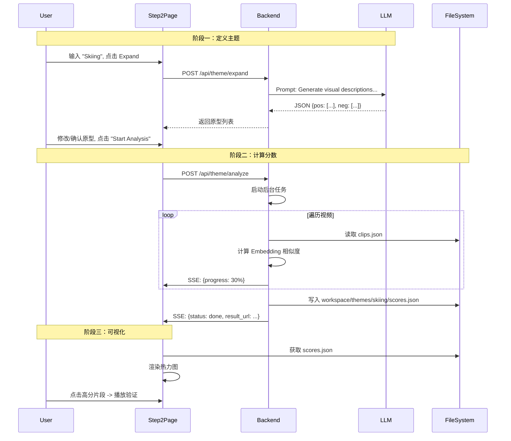

# Stage 2: 主题匹配 (Theme Matching) 前后端对齐方案

本阶段目标是实现**基于语义的视频理解**。
前端将不再只是简单的“播放器”，而是变身为一个**语义分析工作台**。用户通过自然语言定义主题，后端利用大模型将主题转化为机器可理解的原型 (Prototypes)，并计算所有视频片段与该主题的匹配度 (Relevance Score)。
最终，前端通过热力图 (Heatmap) 可视化这些分数，帮助用户直观地看到“哪些片段最符合主题”。

---

## 0. 文件系统与数据流扩展

为了支持多主题实验（例如用户可能想对比 "Skiing" 和 "Snowboarding" 的不同结果），我们需要一个专门的目录来存储不同主题的分析结果。

*   **工作区目录结构 (Workspace Structure)**:
    ```text
    workspace/
    ├── videos/
    ├── segmentation/           # [Stage 1] 产物
    │   ├── video_A/
    │   │   └── clips.json
    │   └── ...
    └── themes/                 # [Stage 2 新增] 存放主题分析结果
        ├── skiing/             # 主题名 (Sanitized)
        │   └── scores.json     # 包含分数和元数据
        └── happy_moments/
            └── scores.json
    ```

*   **数据流向**:
    1.  **Step 1 (定义)**: 用户输入 "Skiing" -> 点击 "Expand" -> 后端 LLM 生成原型 -> 用户确认。
    2.  **Step 2 (计算)**: 用户点击 "Start Analysis" -> 后端读取所有 `clips.json` -> 计算分数。
    3.  **Step 3 (存储)**: 后端保存结果至 `workspace/themes/skiing/scores.json`。
    4.  **Step 4 (展示)**: 前端读取 JSON -> 渲染热力图。

---

## 1. 后端架构与逻辑扩展 (FastAPI)

后端新增 `ThemeRouter`，包含大模型交互和密集计算任务。

### A. API 接口扩展

#### 1. 主题原型扩展 (`POST /api/theme/expand`)
*   **职责**: 调用 LLM (Deepseek/OpenAI) 将简短的主题词扩展为丰富的语义原型。
*   **输入**: `{ "theme_text": "extreme skiing" }`
*   **输出**:
    ```json
    {
      "positive": ["powder snow", "downhill skiing", "snow spray", "winter mountains"],
      "negative": ["summer beach", "indoor office", "traffic jam", "green grass"]
    }
    ```
*   **逻辑**: 这是一个同步接口（等待 LLM 响应），直接返回给前端供用户编辑。

#### 2. 触发分析任务 (`POST /api/theme/analyze`)
*   **职责**: 接收用户确认的主题配置，启动后台打分任务。
*   **输入**:
    ```json
    {
      "theme": "skiing",            // 原始主题文本
      "positives": [...],           // 用户编辑后的列表
      "negatives": [...],
      "video_ids": ["video_A"],     // 可选：限定视频
      "force": false                // 可选：覆盖已有缓存
    }
    ```
*   **逻辑 (Background Task)**:
    1.  **目录准备**: 创建/清理 `workspace/themes/{theme_slug}/`。
    2.  **数据加载**: 遍历 `workspace/segmentation/` 下所有已切分的 `clips.json`。
    3.  **批量计算**: 加载 `ThemeMatcher` 模型，对每个 clip 的 `vis_emb_avg` 与原型进行余弦相似度计算。
        *   *Optimization*: 尽量使用矩阵运算 (Vectorized Operation) 一次性计算所有 clips。
    4.  **进度推送**: 通过 SSE 推送进度 (例如每处理完一个视频推送一次)。
    5.  **结果保存**: 写入 `scores.json`。

#### 3. 获取分析结果 (`GET /api/theme/{theme_slug}/result`)
*   **职责**: 虽然可以通过静态文件访问，但 API 可以提供更灵活的错误处理（如文件不存在时返回 404）。
*   **逻辑**: 返回 `workspace/themes/{theme_slug}/scores.json` 的内容。

### B. 结果文件结构 (`scores.json`)

```json
{
  "meta": {
    "theme": "skiing",
    "created_at": "2025-12-05T10:00:00",
    "prototypes": { "pos": [...], "neg": [...] }
  },
  "scores": {
    "video_A": [
      { "clip_id": 0, "score": 0.85, "t_start": 0, "t_end": 5 },
      { "clip_id": 1, "score": 0.12, "t_start": 5, "t_end": 8 }
    ],
    "video_B": [ ... ]
  }
}
```

---

## 2. 前端功能与交互逻辑 (React)

对应 `VidSynth-Visualizer/components/Step2Semantic.tsx`。

### A. 主题配置区 (Theme Configuration)
*   **输入框**: 用户输入主题 (如 "Skiing")。
*   **Expand 按钮**: 调用 `/api/theme/expand`。Loading 状态下禁用。
*   **原型编辑器 (Prototype Editor)**:
    *   展示两个列表 (Positive / Negative)。
    *   每个列表项支持**增删改**。用户可能想手动添加某些特定的视觉元素（如 "red jacket"）。
*   **Start Analysis 按钮**:
    *   点击后，锁定界面，显示全局进度条。
    *   监听 SSE 事件：`stage=theme_match`，按 `status/progress` 更新进度。

### B. 可视化区 (Visualization) - 分析完成后显示

当 SSE 收到 `status: done` 或用户主动加载已有主题时：

#### 1. 全局热力图 (Global Heatmap)
*   **视图设计**:
    *   **Y轴**: 视频 ID (Video A, Video B...)。
    *   **X轴**: 时间轴 (Normalized Time 或 Clip Index)。
    *   **颜色**: 也就是 `theme_score`。
        *   深红/高亮: High Score (强相关)。
        *   灰色/冷色: Low Score (不相关)。
*   **交互**: 鼠标悬停显示 Score；点击某个“热点”格子，下方“Segment Inspection”面板跳转到该片段。

#### 2. 片段检视 (Segment Inspection)
*   **布局**: 类似于 Step 1 的 Timeline，但这次是**按分数排序**或**阈值过滤**后的视图。
*   **Top K 展示**: 自动列出分数最高的 5-10 个片段。
*   **播放联动**: 点击任意片段，主播放器跳转播放该片段，验证是否真的符合主题。

---

## 3. 总结：Stage 2 交互流程


